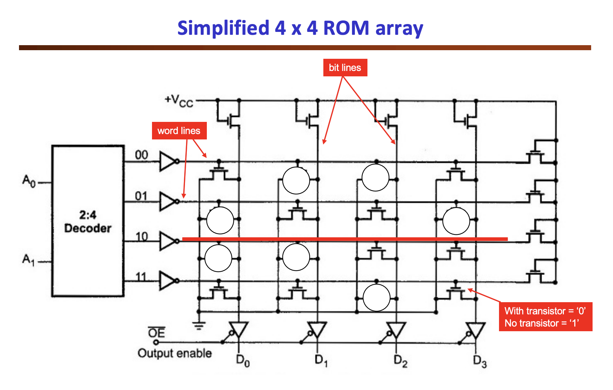

# TASK 1 - Simple Sinewave Generator

## STEP 1 - Specifying a 256 x 8 bit ROM

Read-Only Memory (ROMs) are a type of computer storage containing non-volatile data. This data has a unique address within the ROM through which it can be recovered.

The storing unit within ROMs can be mapped to matrices of size *BITS_PER_ENTRY x NB_ADDRESSES*, as seen in the diagram below.



In SystemVerilog, we would use the command `DATA_WIDTH-1:0] rom_array [2**ADDRESS_WIDTH-1:0]` to create that array:

``` SystemVerilog
module rom # (
    parameter   ADDRESS_WIDTH = 8,
                DATA_WIDTH = 8
)(
    input   logic                       clk,
    input   logic   [ADDRESS_WIDTH-1:0] addr,
    output  logic   [DATA_WIDTH-1:0]    dout
);

    logic [DATA_WIDTH-1:0] rom_array [2**ADDRESS_WIDTH-1:0]; // array for ROM memory unit

    initial begin
            $display("Loading rom.");
            $readmemh("sinerom.mem", rom_array);
    end;

    always_ff @ (posedge clk)
        // output is synchronous
        dout <= rom_array [addr];

endmodule
```


Here, the behaviour of the ROM is modelled using D flip-flops.

The `initial` phase ensures data is loaded into the ROM from the `sinerom.mem` file.
This `sinerom.mem` file and is itself generated by the following Python Script:

```Python
import math
import string
f = open("sinerom.mem", "w")
for i in range(256):
    v = int(math.cos(2*3.1416*i/256)*127+127)
    if (i+1) % 16 == 0:
        s = "{hex:2X}\n"
    else:
        s = "{hex:2X} "
    f.write(s.format(hex=v))

f.close()
```

`sinerom.mem` then lists the consecutive amplitudes of the cosine function:
$$f(t)=cos(2πt/256)$$

NB. This cosine is being sampled 256 times per period. Each one of these samples will occupy one memory location within our ROM.


## STEP 2 - Create the sinegen module

To display the ROM's sinewave, use the counter created in LAB1 to iterate through the ROM's available addresses:


In the top sheet `sinegen.sv`, instantiate a `counter` and `rom`:

```SystemVerilog
module sinegen # (
    parameter   A_WIDTH = 8,
                D_WIDTH = 8
)(
    input logic                     clk,
    input logic                     rst,
    input logic                     en,
    input logic     [D_WIDTH-1:0]   incr,
    output logic    [D_WIDTH-1:0]   dout   
);

    logic[A_WIDTH-1:0]              address;

    counter addrCounter (
        .clk (clk),
        .rst (rst),
        .en (en),
        .incr (incr),
        .count (address)
    );

    rom sineRom (
        .clk (clk),
        .addr (address),
        .dout (dout)
    );

endmodule
```


## STEP 3 -  Create the testbench for sinegen

To test our model, we created the following C++ `sinegen_tb.cpp` testbench:

The C++ testbench  `sinegen_tb.cpp` testing our top sheet should:
1. Instantiate of the DUT
2. Connect to Vbuddy
3. Set-up of VCD wavetracer file for troubleshooting
4. Initialise of input variables `clk`, `rst`, `en` and `incr`
5. Emulate of `clk` through `for` loop, and dump of input and output values at clock edges
6. Allow for visualisation of output `dout` through Vbuddy

```C++
#include "Vsinegen.h"
#include "verilated.h"
#include "verilated_vcd_c.h"
#include "vbuddy.cpp"

int main(int argc, char **argv, char **env)
{
    int tick;
    int simcyc;

    Verilated::commandArgs(argc, argv);

    // init top verilog instance, sinegen
    Vsinegen *top = new Vsinegen;

    // init trace dump
    Verilated::traceEverOn(true);
    VerilatedVcdC *tfp = new VerilatedVcdC;
    top->trace(tfp, 99);
    tfp->open("sinegen.vcd");

    // init Vbuddy
    if (vbdOpen() != 1)
        return (-1);
    vbdHeader("Lab 2: Sine Generator");

    // init simulation inputs
    top->clk = 1;
    top->rst = 0;
    top->en = 1;
    top->incr = 1;

    // run simulation for N samples
    for (simcyc = 0; simcyc < MAX_SIM_CYC; simcyc++)
    {

        for (tick = 0; tick < 2; tick++)
        {
            tfp->dump(2 * simcyc + tick);
            top->clk = !top->clk;
            top->eval();
        }

        // ++++ Send count value to Vbuddy
        vbdPlot(int(top->dout), 0, 256);
        vbdCycle(simcyc + 1);

        if ((Verilated::gotFinish()) || (vbdGetkey() == 'q')) // EXIT CODE IF Q IS TOGGLED
        {
            exit(0);
        }
    }

    vbdClose();
    tfp->close();
    exit(0);
}
```


## STEP 4 - Modify the SHELL script

The SHELL script should:
- Compile into C++ through Verilator all our SystemVerilog modules, namely `sinegen.sv`, `rom.sv` and `counter.sv`
- Associate the testbench `sinegen_tb.cpp` to `sinegen.sv`

```Shell
#!/bin/sh

#cleanup
rm -rf obj_dir
rm -f counter.vcd

#run Verilator to translate Verilog into C++, including C++ testbench
verilator -Wall --cc --trace sinegen.sv --exe sinegen_tb.cpp
verilator -Wall --cc --trace rom.sv
verilator -Wall --cc --trace counter.sv

#build c++ project via make autormatically generated by Verilator
make -j -C obj_dir/ -f Vsinegen.mk Vsinegen

#run executable simulation file
obj_dir/Vsinegen
```


Testing our signal generator:
https://youtu.be/_5TnbKOoQ0o

## STEP 5 - Modify the sinewave's frequency

The sinewave generated through the Python algorithm has equation:
$$f[n]=cos(2πn/256)$$

We had previously set $incr=1$ for our `counter.sv` module.
By setting `incr` to a value different to 1, we effectively modify the frequency of our sinewave.

Indeed, assuming that, for clock cycle 0, since ROM_ADDR = 0:

| | ROM Address Read for clk $n$ | Sinewave Amplitude | Frequency |
|---| ----------- | ------ | -- |
| $incr=1$  | $n$ | $cos(2πn/256)$ | $Ω_0=2π/256$ |
| $incr>1$ | $n*incr$ | $cos(2πn*incr/256)$ | $Ω_i=2π*incr/256$ |

Then:
$$Ω_i=Ω_0*incr$$
$$f_i=f_0*incr$$


Adjusting the testbench to allow for user-determination of `incr` through the rotary encoder:
	`top->incr = vbdVal();`


Testing that program with the updated testbench:

https://youtu.be/fgbtAwp0Qh8