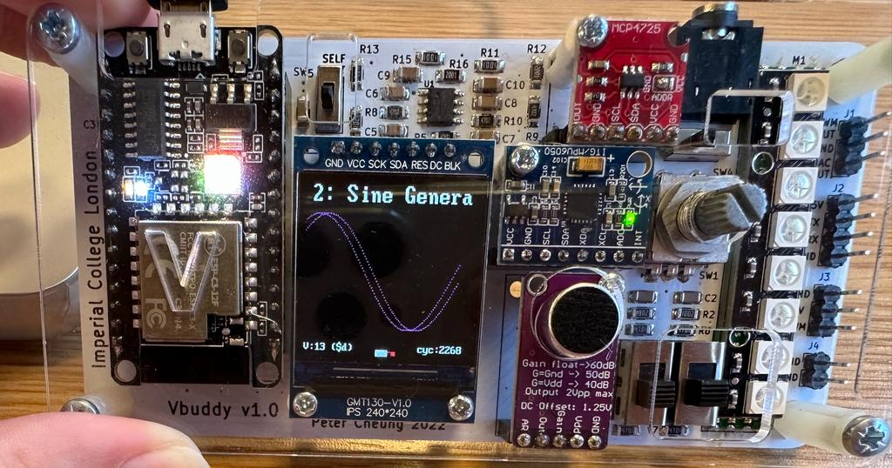

# TASK 2 - Sine and Cosine Dual Wave

Offsetting the read-address by a value $offset$ implies a phase-shift of our sinewave by:
$$ϕ=2π*offset/256$$
Indeed:

| $addr1$ | Sinewave Amplitude | $addr2$ | Sinewave Amplitude | Phase $ϕ$ |
|---| ----------- | ------ | -- | -- |
|$n$| $cos(2πn/256)$ | $n+offset$ | $cos(2π(n+offset)/256)$ | $2π*offset/256$ |


## STEP 1 - Creating a dual-port ROM

Two different sinewave amplitudes, at `addr1` and `addr2`, should be read simultaneously:

``` SystemVerilog
module rom # (
    parameter   ADDRESS_WIDTH = 8,
                DATA_WIDTH = 8
)(
    input   logic                       clk,
    input   logic   [ADDRESS_WIDTH-1:0] addr1,
    input   logic   [ADDRESS_WIDTH-1:0] addr2,
    output  logic   [DATA_WIDTH-1:0]    dout1,
    output  logic   [DATA_WIDTH-1:0]    dout2

);

    logic [DATA_WIDTH-1:0] rom_array [2**ADDRESS_WIDTH-1:0];

    initial begin
            $display("Loading rom.");
            $readmemh("sinerom.mem", rom_array);
    end;

    always_ff @ (posedge clk) begin
        // output is synchronous
        dout1 <= rom_array [addr1];
        dout2 <= rom_array [addr2];
    end

endmodule
```


## STEP 2 - Modifying the top file

Modify the top file `sinegen.sv` to account for the new inputs (`offset`, `addr1`, `addr2`) and outputs (`dout1` and `dout2`).

Defining $addr2≡addr1+offset$  $[256$]:

``` SystemVerilog
module sinegen # (
    parameter   A_WIDTH = 8,
                D_WIDTH = 8
)(
    input logic                     clk,
    input logic                     rst,
    input logic                     en,
    input logic     [D_WIDTH-1:0]   incr,
    input logic     [D_WIDTH-1:0]   offset,     
    output logic    [D_WIDTH-1:0]   dout1,
    output logic    [D_WIDTH-1:0]   dout2   
);

    logic           [A_WIDTH-1:0]   address;

    counter addrCounter (
        .clk (clk),
        .rst (rst),
        .en (en),
        .incr (incr),
        .count (address)
    );

    rom sineRom (
        .clk (clk),
        .addr1 (address),
        .addr2 (address + offset),
        .dout1 (dout1),
        .dout2 (dout2)
    );

endmodule
```

## STEP 3 - Modifying the testbench

Modifying the testbench so that both sinewaves are displayed and `offset` is derived from the rotary encoder:

``` C++
#include "Vsinegen.h"
#include "verilated.h"
#include "verilated_vcd_c.h"
#include "vbuddy.cpp"

#define MAX_SIM_CYC 1000000

int main(int argc, char **argv, char **env)
{
    int tick;
    int simcyc;

    Verilated::commandArgs(argc, argv);

    // init top verilog instance, sinegen
    Vsinegen *top = new Vsinegen;

    // init trace dump
    Verilated::traceEverOn(true);
    VerilatedVcdC *tfp = new VerilatedVcdC;
    top->trace(tfp, 99);
    tfp->open("sinegen.vcd");

    // init Vbuddy
    if (vbdOpen() != 1)
        return (-1);
    vbdHeader("Lab 2: Sine Generator");

    // init simulation inputs
    top->clk = 1;
    top->rst = 0;
    top->en = 1;
    top->incr = 1;
    top->offset = vbdValue(); // offset value is defined through rotary encoder

    // run simulation for N samples
    for (simcyc = 0; simcyc < MAX_SIM_CYC; simcyc++)
    {

        for (tick = 0; tick < 2; tick++)
        {
            tfp->dump(2 * simcyc + tick);
            top->clk = !top->clk;
            top->eval();
        }

        // ++++ Send count value to Vbuddy
        vbdPlot(int(top->dout1), 0, 256);
        vbdPlot(int(top->dout2), 0, 256);
        vbdCycle(simcyc);

        // modify signal frequency
        top->offset = vbdValue();

        if ((Verilated::gotFinish()) || (vbdGetkey() == 'q'))
        {
            exit(0);
        }
    }

    vbdClose();
    tfp->close();
    exit(0);
}
```


Testing the program:


For an offset of 13:


For an offset of 89:

## STEP 4 - Outputting a sinewave

To output a sinewave, we would need a phase-shift of $ϕ=π/2$.

Then, we should set $offset=256/4=64$.

The obtained signals are then called *quadrature signals*:

