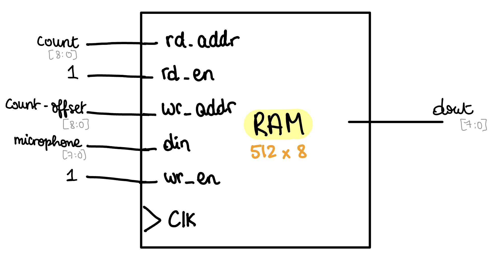

# TASK 3 - Capture and Display Audio in a RAM

## STEP 1 - Creating a dual-port RAM

We first need to create a 512x8 dual port RAM to dynamically read and save the microphone's input:



``` SystemVerilog
module ram2ports # (
    parameter   ADDRESS_WIDTH = 9, // since RAM must have 512 addresses
                DATA_WIDTH = 8
)(
    input   logic                       clk,
    input   logic                       wr_en,
    input   logic                       rd_en,
    input   logic   [ADDRESS_WIDTH-1:0] wr_addr,
    input   logic   [ADDRESS_WIDTH-1:0] rd_addr,
    input   logic   [DATA_WIDTH-1:0]    din,
    output  logic   [DATA_WIDTH-1:0]    dout
);

    logic   [DATA_WIDTH-1:0]    ram_array   [2**ADDRESS_WIDTH-1:0];

    always_ff @ (posedge clk) begin
        if (wr_en == 1'b1)
            ram_array[wr_addr] <= din;
        if (rd_en == 1'b1)
            dout <= ram_array [rd_addr];
    end
endmodule
```


Note that RAMs can also be modelled through arrays and D-FlipFlops. Indeed:


## STEP 2 - Writing the top file

We then need to create a top sheet instantiating `count` and `ram2ports` modules:


```SystemVerilog
module sigdelay # (
    parameter  ADDRESS_WIDTH = 9,
    parameter   DATA_WIDTH = 8
) (
    input   logic                       clk,
    input   logic                       rst,
    input   logic                       wr,
    input   logic                       rd,
    input   logic   [ADDRESS_WIDTH-1:0] offset,
    input   logic   [DATA_WIDTH-1:0]    mic_signal,
    output  logic   [DATA_WIDTH-1:0]    delayed_signal
);

    logic           [ADDRESS_WIDTH-1:0] addr;

    counter signalCounter(
        .clk(clk),
        .rst(rst),
        .en(1),
        .incr(offset),
        .count(addr)

    );

    ram2ports signalRAM (
        .clk(clk),
        .wr_en(wr),
        .rd_en(rd),
        .wr_addr(addr),
        .rd_addr(addr - offset),
        .din(mic_signal),
        .dout(delayed_signal)
    );

endmodule
```


## STEP 3 - Modifying the testbench and ShellScript

The testbench should:
- Define the buffer for microphone input through `vbdInitMicIn()`
-  Define the offset between the read and write address through `vbdValue()`, and save value into `offset`
- Track microphone input through `vbdMicValue()`, and save that value into `mic_signal`

Modifying the Shell Script so that it:
- Compiles into C++ through Verilator all our SystemVerilog modules, namely `sigdelay.sv`, `ram2ports.sv` and `counter.sv`
- Associate the testbench `sinegen_tb.cpp` to `sinegen.sv`

```Shell
#!/bin/sh

#cleanup
rm -rf obj_dir
rm -f sigdelay.vcd

#run Verilator to translate Verilog into C++, including C++ testbench
verilator -Wall --cc --trace sigdelay.sv --exe sigdelay_tb.cpp
verilator -Wall --cc --trace ram2ports.sv
verilator -Wall --cc --trace counter.sv

#build c++ project via make autormatically generated by Verilator
make -j -C obj_dir/ -f Vsigdelay.mk Vsigdelay

#run executable simulation file
obj_dir/Vsigdelay
```

Compiling and testing:

https://youtu.be/0gerCLdfIhE
